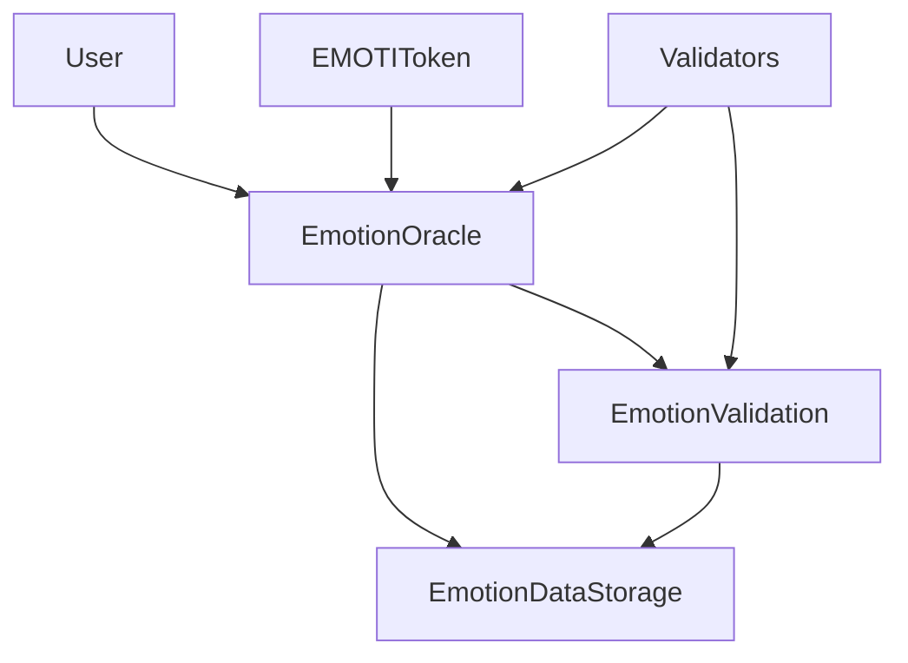

# EmotiLink OS API Documentation

## 📚 Overview

This document provides comprehensive API documentation for the EmotiLink OS smart contracts and frontend integration. The system consists of four main smart contracts working together to process, validate, and store emotional data.

## 🏗️ Smart Contract Architecture

### Contract Overview

| Contract | Purpose | Key Features |
|----------|---------|--------------|
| **EMOTIToken** | ERC20 token for the platform | Minting, burning, oracle integration |
| **EmotionOracle** | Main oracle for data processing | Data submission, validator management |
| **EmotionValidation** | Data validation and fraud detection | Rule-based validation, integrity checks |
| **EmotionDataStorage** | Secure data storage and analytics | Data persistence, user profiles, analytics |

## 🔗 Contract Integration



## 📋 EMOTIToken Contract

### Contract Address
```
NEXT_PUBLIC_EMOTI_TOKEN_ADDRESS=<deployed_address>
```

### Key Functions

#### `mint(address to, uint256 amount)`
Mint new EMOTI tokens to a specified address.

**Parameters:**
- `to`: Address to receive tokens
- `amount`: Amount of tokens to mint

**Access:** Owner only

#### `burn(uint256 amount)`
Burn tokens from the caller's balance.

**Parameters:**
- `amount`: Amount of tokens to burn

**Access:** Public

#### `setOracle(address oracle)`
Set the oracle contract address.

**Parameters:**
- `oracle`: Address of the emotion oracle contract

**Access:** Owner only

### Events

```solidity
event TokensMinted(address indexed to, uint256 amount);
event TokensBurned(address indexed from, uint256 amount);
```

## 🔮 EmotionOracle Contract

### Contract Address
```
NEXT_PUBLIC_EMOTION_ORACLE_ADDRESS=<deployed_address>
```

### Key Functions

#### `submitEmotionData(uint8 emotionType, uint8 intensity, uint8 confidence, string context)`
Submit emotional data for processing.

**Parameters:**
- `emotionType`: Type of emotion (0-5)
  - 0: Joy
  - 1: Sadness
  - 2: Anger
  - 3: Fear
  - 4: Surprise
  - 5: Disgust
- `intensity`: Intensity level (1-10)
- `confidence`: Confidence level (1-100)
- `context`: Additional context about the emotion

**Access:** Public

**Events:**
```solidity
event EmotionDataSubmitted(
    uint256 indexed dataId,
    address indexed submitter,
    uint8 emotionType,
    uint8 intensity,
    uint8 confidence,
    string context
);
```

#### `registerValidator()`
Register as a validator by staking a minimum amount.

**Access:** Public (payable)

**Requirements:**
- Must send minimum stake amount
- Cannot be already registered

**Events:**
```solidity
event ValidatorRegistered(
    address indexed validator,
    uint256 stakeAmount,
    uint256 timestamp
);
```

#### `validateEmotionData(uint256 dataId, bool isValid)`
Validate emotional data submitted by users.

**Parameters:**
- `dataId`: ID of the emotion data to validate
- `isValid`: True if data is valid, false otherwise

**Access:** Validators only

**Events:**
```solidity
event EmotionDataValidated(
    uint256 indexed dataId,
    address indexed validator,
    bool isValid,
    uint256 timestamp
);
```

### View Functions

#### `getEmotionData(uint256 dataId)`
Get emotion data by ID.

**Returns:** EmotionData struct

#### `getValidator(address validator)`
Get validator information.

**Returns:** Validator struct

#### `getContractStats()`
Get contract statistics.

**Returns:**
- `totalData`: Total number of emotion data entries
- `totalValidators`: Total number of active validators
- `contractBalance`: Current contract balance

## ✅ EmotionValidation Contract

### Contract Address
```
NEXT_PUBLIC_EMOTION_VALIDATION_ADDRESS=<deployed_address>
```

### Key Functions

#### `validateData(uint256 dataId, uint8 emotionType, uint8 intensity, uint8 confidence, address validator)`
Validate emotional data against predefined rules.

**Parameters:**
- `dataId`: ID of the data to validate
- `emotionType`: Type of emotion
- `intensity`: Intensity level
- `confidence`: Confidence level
- `validator`: Address of the validator

**Access:** Oracle only

#### `setValidationRule(uint8 emotionType, uint8 minIntensity, uint8 maxIntensity, uint8 minConfidence, bool isActive)`
Create or update validation rules.

**Parameters:**
- `emotionType`: Type of emotion
- `minIntensity`: Minimum intensity
- `maxIntensity`: Maximum intensity
- `minConfidence`: Minimum confidence
- `isActive`: Whether rule is active

**Access:** Owner only

### View Functions

#### `getValidationResults(uint256 dataId)`
Get validation results for specific data.

**Returns:** Array of ValidationResult structs

#### `getDataIntegrity(uint256 dataId)`
Get data integrity information.

**Returns:** DataIntegrity struct

#### `isDataValidated(uint256 dataId)`
Check if data meets validation requirements.

**Returns:** Boolean

## 💾 EmotionDataStorage Contract

### Contract Address
```
NEXT_PUBLIC_EMOTION_DATA_STORAGE_ADDRESS=<deployed_address>
```

### Key Functions

#### `storeValidatedData(uint256 dataId, uint8 emotionType, uint8 intensity, uint8 confidence, string context, address submitter)`
Store validated emotional data.

**Parameters:**
- `dataId`: Original data ID from oracle
- `emotionType`: Type of emotion
- `intensity`: Intensity level
- `confidence`: Confidence level
- `context`: Additional context
- `submitter`: Address of the submitter

**Access:** Oracle only

#### `processData(uint256 storageId, uint256 validationScore)`
Process stored data and update analytics.

**Parameters:**
- `storageId`: Storage ID of the data
- `validationScore`: Validation score from validation contract

**Access:** Validation contract only

### View Functions

#### `getStoredData(uint256 storageId)`
Get stored data by storage ID.

**Returns:** StoredEmotionData struct

#### `getUserProfile(address user)`
Get user profile information.

**Returns:**
- `user`: User address
- `totalSubmissions`: Total number of submissions
- `validatedSubmissions`: Number of validated submissions
- `averageEmotionIntensity`: Average emotion intensity
- `lastActivity`: Last activity timestamp

#### `getEmotionAnalytics(uint8 emotionType)`
Get analytics for specific emotion type.

**Returns:** EmotionAnalytics struct

#### `getAllEmotionAnalytics()`
Get analytics for all emotion types.

**Returns:** Array of EmotionAnalytics structs

## 🚀 Frontend Integration

### Alchemy SDK Setup

```typescript
import { Alchemy, Network } from 'alchemy-sdk';

const alchemyConfig = {
  apiKey: process.env.NEXT_PUBLIC_ALCHEMY_API_KEY,
  network: Network.MATIC_MUMBAI, // or Network.MATIC_MAINNET
};

const alchemy = new Alchemy(alchemyConfig);
```

### Contract Service Usage

```typescript
import { contractService } from '@/lib/contracts';

// Submit emotion data
const tx = await contractService.submitEmotionData(
  0, // joy
  8, // intensity
  85, // confidence
  "Feeling great today!"
);

// Register as validator
const validatorTx = await contractService.registerValidator("0.1");

// Get emotion data
const data = await contractService.getEmotionData(1);

// Get user profile
const profile = await contractService.getUserProfile(userAddress);
```

### React Hooks

#### `useEmotionData`
```typescript
const { submitEmotion, loading, error } = useEmotionData();

const handleSubmit = async (emotionType: number, intensity: number, confidence: number, context: string) => {
  try {
    await submitEmotion(emotionType, intensity, confidence, context);
    // Handle success
  } catch (error) {
    // Handle error
  }
};
```

#### `useValidator`
```typescript
const { registerValidator, validateData, isValidator } = useValidator();

const handleRegister = async (stakeAmount: string) => {
  try {
    await registerValidator(stakeAmount);
    // Handle success
  } catch (error) {
    // Handle error
  }
};
```

## 📊 Data Structures

### EmotionData
```solidity
struct EmotionData {
    uint256 timestamp;
    uint8 emotionType;
    uint8 intensity;
    uint8 confidence;
    string context;
    address submitter;
    bool isValidated;
}
```

### Validator
```solidity
struct Validator {
    address validatorAddress;
    bool isActive;
    uint256 stakeAmount;
    uint256 reputationScore;
    uint256 totalValidations;
    uint256 successfulValidations;
}
```

### ValidationRule
```solidity
struct ValidationRule {
    uint8 emotionType;
    uint8 minIntensity;
    uint8 maxIntensity;
    uint8 minConfidence;
    bool isActive;
    uint256 createdAt;
}
```

### EmotionAnalytics
```solidity
struct EmotionAnalytics {
    uint8 emotionType;
    uint256 totalCount;
    uint256 averageIntensity;
    uint256 averageConfidence;
    uint256 lastUpdated;
}
```

## 🔐 Security Considerations

### Access Control
- **Owner Functions**: Critical operations like pausing, setting parameters
- **Oracle Functions**: Data submission and storage operations
- **Validator Functions**: Data validation operations
- **Public Functions**: Read-only operations and user interactions

### Validation Rules
- Emotion-specific intensity ranges
- Confidence thresholds
- Suspicious pattern detection
- Multi-validator consensus

### Gas Optimization
- Efficient data structures
- Batch operations where possible
- Event-driven architecture
- Storage optimization

## 🚨 Error Handling

### Common Errors

#### `"Not an active validator"`
- **Cause**: Trying to validate data without being a registered validator
- **Solution**: Register as validator first

#### `"Invalid emotion type"`
- **Cause**: Emotion type not in range 0-5
- **Solution**: Use valid emotion types (0: joy, 1: sadness, 2: anger, 3: fear, 4: surprise, 5: disgust)

#### `"Intensity out of valid range"`
- **Cause**: Intensity not in range 1-10
- **Solution**: Use valid intensity values

#### `"Confidence below threshold"`
- **Cause**: Confidence below minimum threshold for emotion type
- **Solution**: Increase confidence or check validation rules

### Error Recovery

```typescript
try {
  await contractService.submitEmotionData(emotionType, intensity, confidence, context);
} catch (error) {
  if (error.message.includes("Invalid emotion type")) {
    // Handle invalid emotion type
  } else if (error.message.includes("Intensity out of valid range")) {
    // Handle invalid intensity
  } else {
    // Handle other errors
  }
}
```

## 📈 Performance Optimization

### Batch Operations
```typescript
// Submit multiple emotions at once
const emotions = [
  { type: 0, intensity: 8, confidence: 85, context: "Happy" },
  { type: 1, intensity: 3, confidence: 70, context: "Sad" }
];

for (const emotion of emotions) {
  await contractService.submitEmotionData(
    emotion.type,
    emotion.intensity,
    emotion.confidence,
    emotion.context
  );
}
```

### Event Listening
```typescript
// Listen for emotion data events
const filter = {
  address: emotionOracleAddress,
  topics: [ethers.utils.id("EmotionDataSubmitted(address,uint256,uint8,uint8,uint8,string)")]
};

alchemy.ws.on(filter, (log) => {
  // Handle new emotion data
  console.log("New emotion data submitted:", log);
});
```

## 🔧 Configuration

### Environment Variables
```env
# Alchemy Configuration
ALCHEMY_API_KEY=Gc18loKVH6D9R4tmbyK5P
NEXT_PUBLIC_ALCHEMY_API_KEY=Gc18loKVH6D9R4tmbyK5P

# Network Configuration
NEXT_PUBLIC_NETWORK=polygon-mumbai
NEXT_PUBLIC_CHAIN_ID=80001

# Contract Addresses
NEXT_PUBLIC_EMOTI_TOKEN_ADDRESS=0x...
NEXT_PUBLIC_EMOTION_ORACLE_ADDRESS=0x...
NEXT_PUBLIC_EMOTION_VALIDATION_ADDRESS=0x...
NEXT_PUBLIC_EMOTION_DATA_STORAGE_ADDRESS=0x...
```

### Network Configuration
```typescript
export const networkConfig = {
  polygonMumbai: {
    chainId: 80001,
    name: 'Polygon Mumbai',
    rpcUrl: 'https://polygon-mumbai.g.alchemy.com/v2/Gc18loKVH6D9R4tmbyK5P',
    blockExplorer: 'https://mumbai.polygonscan.com',
  },
  polygonMainnet: {
    chainId: 137,
    name: 'Polygon Mainnet',
    rpcUrl: 'https://polygon-mainnet.g.alchemy.com/v2/Gc18loKVH6D9R4tmbyK5P',
    blockExplorer: 'https://polygonscan.com',
  },
};
```

## 📚 Examples

### Complete Workflow Example

```typescript
import { contractService } from '@/lib/contracts';

async function completeEmotionWorkflow() {
  try {
    // 1. Submit emotion data
    const submitTx = await contractService.submitEmotionData(
      0, // joy
      8, // intensity
      85, // confidence
      "Feeling great today!"
    );
    console.log("Emotion data submitted:", submitTx.hash);
    
    // 2. Wait for confirmation
    await submitTx.wait();
    
    // 3. Get the submitted data
    const dataId = 1; // Assuming this is the data ID
    const emotionData = await contractService.getEmotionData(dataId);
    console.log("Emotion data:", emotionData);
    
    // 4. Register as validator (if not already)
    const validatorTx = await contractService.registerValidator("0.1");
    console.log("Validator registered:", validatorTx.hash);
    
    // 5. Validate the data
    const validateTx = await contractService.validateEmotionData(dataId, true);
    console.log("Data validated:", validateTx.hash);
    
    // 6. Get user profile
    const profile = await contractService.getUserProfile(userAddress);
    console.log("User profile:", profile);
    
  } catch (error) {
    console.error("Workflow error:", error);
  }
}
```

## 🆘 Support

For technical support and questions:

- **Email**: contact@emotilinkos.com
- **Discord**: [Join our community](https://discord.gg/emotilink)
- **GitHub**: [Report issues](https://github.com/emotilink-os/emotilink-os/issues)
- **Documentation**: [Full docs](https://docs.emotilinkos.com)

---

**Last Updated**: [Current Date]  
**Version**: 1.0.0  
**Maintained by**: EmotiLink OS Development Team
