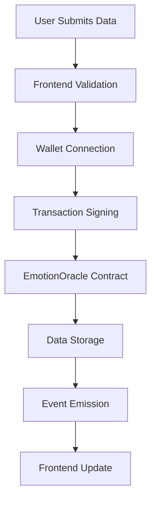
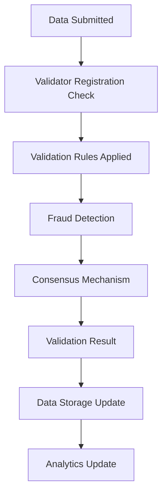
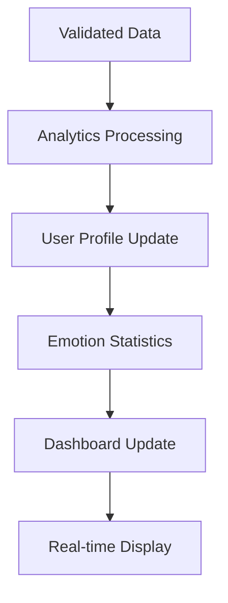

# EmotiLink OS Architecture Documentation

## 🏗️ System Overview

EmotiLink OS is a blockchain-powered emotional intelligence platform that combines advanced oracle technology with smart contracts to create a secure, decentralized system for processing and validating emotional data.

## 🎯 Core Components

### 1. Smart Contract Layer

#### EmotionOracle.sol
The main oracle contract that handles emotional data processing and validation.

**Key Responsibilities**:
- Data submission and storage
- Validator management and staking
- Reputation scoring system
- Event logging and transparency

**Core Functions**:
```solidity
function submitEmotionData(
    uint8 _emotionType,
    uint8 _intensity,
    uint8 _confidence,
    string memory _context
) external

function registerValidator() external payable

function validateEmotionData(
    uint256 _dataId,
    bool _isValid
) external onlyValidator
```

**Data Structures**:
```solidity
struct EmotionData {
    uint256 timestamp;
    uint8 emotionType; // 0: joy, 1: sadness, 2: anger, 3: fear, 4: surprise, 5: disgust
    uint8 intensity; // 1-10 scale
    uint8 confidence; // 1-100 percentage
    string context;
    address validator;
    bool isValidated;
}

struct Validator {
    address validatorAddress;
    bool isActive;
    uint256 stakeAmount;
    uint256 reputationScore;
    uint256 totalValidations;
    uint256 successfulValidations;
}
```

#### EmotionValidation.sol
Advanced validation contract with fraud detection and rule-based validation.

**Key Responsibilities**:
- Rule-based data validation
- Fraud detection algorithms
- Data integrity monitoring
- Validation result tracking

**Core Functions**:
```solidity
function validateData(
    uint256 _dataId,
    uint8 _emotionType,
    uint8 _intensity,
    uint8 _confidence,
    address _validator
) external onlyOracle

function setValidationRule(
    uint8 _emotionType,
    uint8 _minIntensity,
    uint8 _maxIntensity,
    uint8 _minConfidence,
    bool _isActive
) external onlyOwner
```

**Validation Rules**:
- Emotion-specific intensity ranges
- Confidence thresholds
- Suspicious pattern detection
- Multi-validator consensus

#### EmotionDataStorage.sol
Storage contract for validated emotional data with analytics and user profiles.

**Key Responsibilities**:
- Secure data storage
- Analytics collection
- User profile management
- Performance metrics

**Core Functions**:
```solidity
function storeValidatedData(
    uint256 _dataId,
    uint8 _emotionType,
    uint8 _intensity,
    uint8 _confidence,
    string memory _context,
    address _submitter
) external onlyOracle

function processData(
    uint256 _storageId,
    uint256 _validationScore
) external onlyValidationContract
```

### 2. Frontend Layer

#### Next.js Application
Modern React-based frontend with TypeScript and Tailwind CSS.

**Key Features**:
- Responsive design (mobile/desktop)
- Dark theme implementation
- Real-time data visualization
- Wallet integration
- Analytics dashboard

**Component Structure**:
```
app/
├── layout.tsx          # Root layout
├── page.tsx            # Landing page
├── globals.css         # Global styles
├── components/         # Reusable components
├── hooks/             # Custom React hooks
├── lib/               # Utility functions
└── types/             # TypeScript definitions
```

**Key Components**:
- **Header**: Navigation and wallet connection
- **Hero Section**: Main landing area with CTA
- **Features Section**: Platform capabilities showcase
- **Analytics Dashboard**: Real-time metrics and insights
- **Footer**: Links and information

### 3. Blockchain Integration

#### Alchemy SDK Integration
- **Network Support**: Polygon Mumbai (testnet) and Polygon Mainnet
- **API Management**: Centralized API key management
- **Transaction Handling**: Automated transaction processing
- **Event Monitoring**: Real-time event listening

#### Wallet Integration
- **MetaMask**: Primary wallet provider
- **WalletConnect**: Mobile wallet support
- **RainbowKit**: Wallet connection UI
- **Wagmi**: React hooks for Ethereum

### 4. CI/CD Pipeline

#### GitHub Actions Workflows

**CI Pipeline** (`ci.yml`):
- Linting and code quality checks
- Smart contract compilation and testing
- Security analysis (Slither, MythX)
- Frontend testing and building
- Automated deployment to testnet/mainnet

**Security Pipeline** (`security.yml`):
- Weekly security audits
- Automated vulnerability scanning
- Smart contract fuzzing
- PR security feedback

## 🔄 Data Flow Architecture

### 1. Data Submission Flow



### 2. Validation Flow



### 3. Analytics Flow



## 🛡️ Security Architecture

### 1. Smart Contract Security

**Access Control**:
- Owner-only functions for critical operations
- Validator-only functions for validation
- Oracle-only functions for data processing

**Validation Mechanisms**:
- Multi-layer validation system
- Stake-based security model
- Reputation scoring system
- Fraud detection algorithms

**Security Features**:
- ReentrancyGuard protection
- Pausable functionality
- Input validation
- Event logging for transparency

### 2. Frontend Security

**Data Protection**:
- Input sanitization
- XSS prevention
- CSRF protection
- Secure API communication

**Wallet Security**:
- Secure wallet connection
- Transaction signing
- Private key protection
- Network validation

### 3. Infrastructure Security

**CI/CD Security**:
- Automated security scanning
- Dependency vulnerability checks
- Code quality enforcement
- Secure deployment practices

## 📊 Performance Architecture

### 1. Smart Contract Optimization

**Gas Optimization**:
- Efficient data structures
- Optimized function calls
- Batch operations
- Storage optimization

**Scalability**:
- Modular contract design
- Upgradeable patterns
- Event-driven architecture
- Efficient data storage

### 2. Frontend Performance

**Optimization Techniques**:
- Code splitting
- Lazy loading
- Image optimization
- Bundle size optimization

**Real-time Updates**:
- Event listening
- State management
- Efficient re-rendering
- Caching strategies

### 3. Network Performance

**Blockchain Integration**:
- Efficient RPC calls
- Transaction batching
- Event filtering
- Connection pooling

## 🔧 Configuration Management

### 1. Environment Configuration

**Development Environment**:
- Local Hardhat network
- Test contracts
- Mock data
- Debug logging

**Testnet Environment**:
- Polygon Mumbai network
- Test tokens
- Real contract deployment
- Limited functionality

**Production Environment**:
- Polygon Mainnet
- Production contracts
- Full functionality
- Monitoring and alerts

### 2. Contract Configuration

**Network Settings**:
- RPC URLs
- Chain IDs
- Gas settings
- Block confirmations

**Contract Parameters**:
- Minimum stake amounts
- Validation thresholds
- Reward rates
- Time windows

## 📈 Monitoring and Analytics

### 1. Smart Contract Monitoring

**Metrics Tracked**:
- Transaction volume
- Gas usage
- Validation accuracy
- User activity

**Event Monitoring**:
- Data submission events
- Validation events
- Error events
- Performance events

### 2. Frontend Analytics

**User Metrics**:
- Page views
- User interactions
- Performance metrics
- Error tracking

**Business Metrics**:
- Data processing volume
- User engagement
- Feature usage
- Conversion rates

## 🚀 Deployment Architecture

### 1. Smart Contract Deployment

**Deployment Process**:
1. Contract compilation
2. Network configuration
3. Contract deployment
4. Verification
5. Initialization

**Deployment Scripts**:
- Automated deployment
- Contract verification
- Initial configuration
- Testing validation

### 2. Frontend Deployment

**Build Process**:
1. TypeScript compilation
2. Asset optimization
3. Bundle generation
4. Static generation

**Deployment Targets**:
- Vercel (primary)
- Netlify (backup)
- Self-hosted (enterprise)

## 🔮 Future Architecture Considerations

### 1. Scalability Improvements

**Layer 2 Solutions**:
- Polygon zkEVM integration
- Optimistic rollups
- State channels
- Sidechains

**Microservices Architecture**:
- API gateway
- Service mesh
- Container orchestration
- Load balancing

### 2. Advanced Features

**AI/ML Integration**:
- Machine learning models
- Predictive analytics
- Pattern recognition
- Automated insights

**Cross-chain Compatibility**:
- Multi-chain support
- Bridge integration
- Cross-chain validation
- Universal compatibility

---

**Document Version**: 1.0  
**Last Updated**: [Current Date]  
**Maintained by**: EmotiLink OS Development Team
